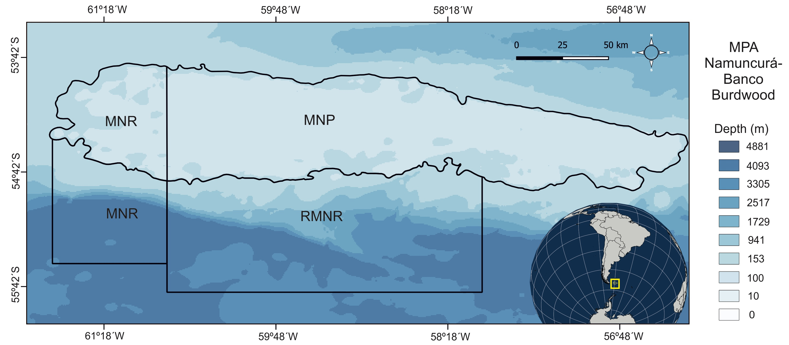

---
output:
  pdf_document:
    latex_engine: xelatex
    keep_tex: yes
  word_document: default
bibliography: AMPBancoBurdwood.bib
csl: "elsevier-harvard2.csl"
documentclass: article
geometry:
- vmargin=1in
- hmargin=1in
header-includes:
- \usepackage{amsmath}
- \usepackage{pdflscape,booktabs}
- \newcommand{\blandscape}{\begin{landscape}}
- \newcommand{\elandscape}{\end{landscape}}
- \usepackage[running]{lineno}
- \usepackage{listings}
- \linenumbers
---

# The complex network of trophic interactions in a subAntarctic oceanic Marine Protected Area


## Abstract

The world’s oceans designated under marine protection have increased recently. Most Marine Protected Areas (MPAs) target vulnerable, keystone, charismatic and/or endemic species. In the sub-Antarctic, ocean protection is associated to oceanic islands, except for MPAs Namuncurá - Burdwood Bank I and II (MPA N-BB, ~53º – 55ºS and ~56º – 62ºW), which are associated to a submarine plateau and a southern deep slope, respectively. We present the first analysis of the predator-prey network for the MPA N-BB, applying a topological network approach to characterise the complexity and structure of the food web, and identify the species’ role. The MPA N-BB food web consisted of 1788 interactions and 379 species, with a connectance of 0.01. Almost half of the consumers feed at more than one trophic level (0.48), and the network displayed a small-world pattern (short path length, high clustering of compartments). This network pattern suggests that the ecosystem might be vulnerable to perturbations targeting highly connected species, although some properties might provide resilience and resistance, resulting in a rearranged structure that preserves its original functions. Several species arose as important for the trophic structure and functioning, and response to perturbations. Generalist species, mainly fishes, play a crucial role in the benthopelagic coupling and should be considered as relevant energy transfers for the ecosystem. We argue that the diversity of species, including both the benthic and pelagic habitats, is responsible for securing the connectivity within the food web against perturbations, therefore contributing to the structure and stability of the ecosystem.

Keywords: Food Web, Complexity, Structure, Burdwood Bank, Southwest Atlantic

## 1. Introduction

In recent years, there has been an unprecedented rise in the number of Marine Protected Areas (MPAs) worldwide, driven by both the compelling evidence of their benefits and the pressing need for ocean protection [@Roberts2017; @Sala2018]. Globally, the total area of the world ocean designated under marine protection adds up to approximately 29,600,000 km^2^, distributed across nearly 18,444 MPAs and covering 8.16% of the ocean’s surface [@IUCN2023], and therefore approaching the 10% goal of the Convention of Biological Diversity [@Secretariatoftheconventiononbiologicaldiversity2004]. Although some progress has been made, it has become apparent that the level of protection has been inflated due to the inclusion of regions that have only been declared as protected, as well as areas where significant extractive operations are allowed [@Sala2018].

In the sub-Antarctic region, the level of ocean protection is mainly associated to oceanic islands, such as the South Georgias and South Sandwich, Bouvet, Prince Edward, and Macquarie islands [@IUCN2023]. Interestingly, the case of the Argentine MPAs Namuncurá - Burdwood Bank I and II (MPA N-BB, ~53º–55ºS ~56º–62ºW), which is the focus of this work, is unique since these MPAs are associated to a submarine plateau and its southern adjacent deep slope region, respectively [@Falabella2017; @Schejter2020]. In addition, such MPAs are part of a network of protected areas in the sub-Antarctic area (jointly with MPA Yaganes) that aims to protect this southern region in order to contribute to global ocean health.

Many of these MPAs focus on the presence of particularly vulnerable, keystone, or charismatic species, large numbers (or proportions) of endemic species, and/or high biodiversity across taxonomic levels [@Hogg2016]. Indeed, the MPA N-BB was created to protect a potentially sensitive and biodiverse benthic habitat that was only barely known [@Schejter2016; @Falabella2017]. The benthic community is featured by high biomass of vulnerable and fragile species (mainly Porifera, Bryozoa and Cnidaria) that, considered with their environment, meet the characteristics of vulnerable marine ecosystems [@Schejter2021], here defined as sites that present densities of Indicator Taxa of > 10 kg per 1200 m^2^ [@CommissionfortheConservationofAntarcticMarineLivingResourcesCCAMLR2009]. Also, the benthic realm provides habitat to several small-sized species [@Lopez-Gappa2018; @MartinSirito2019; @Schejter2019], and has an important role in the life history of fishes as a food source, refuge and nursery area [@GarciaAlonso2018; @Vazquez2018; @Delpiani2020; @Troccoli2020; @CovattiAle2022; @Fischer2022; @Matusevich2022; @Florencia2023]. The persistence of this particular community is linked to the interplay of local and regional oceanographic dynamics, encompassing the influence of the nutrient-rich Malvinas current [@Piola1989; @Guerrero1999], and occurrences of upwelling and mixing. Moreover, the influx of nutrients carried by the Malvinas current fosters a varied planktonic ecosystem [@Guinder2020]. Given the cooling trend of this current in a warming regional context (i.e. adjacent waters of the Patagonian shelf and Southwest Atlantic Ocean) [@Franco2022], the MPA N-BB might play an essential role as a refuge maintaining not only the biodiversity but also the fisheries' populations of the region [@Franco2020].

Maintaining ocean ecosystem services relies on a healthy ocean, and biological species play a key role in this process. It is essential to identify the main species involved in sustaining this health for effective management and conservation purposes. In this regard, @Bergagna2020 have identified the principal ecosystem services that are provided by species inhabiting the MPA N-BB; for instance, nursery and feeding areas for commercially important fishes (e.g. Patagonian grenadier *Macruronus magellanicus*, Patagonian toothfish *Dissostichus eleginoides*), water purification by filter feeders (e.g. sponges), among others. These species are part of a complex system in terms of biodiversity. There is robust knowledge on the complexity considering the richness of the benthic and plankton communities in the MPA N-BB ecosystem [@Schejter2016; @Guinder2020; @Schejter2020; @AdministraciondeParquesNacionales2022]. Overall, 811 benthic and plankton species have been identified in the MPA N-BB ecosystem, where 349 were reported for the first time in the area in recent years [@AdministraciondeParquesNacionales2022]. Recently, the structure of the southwestern South Atlantic Ocean has been hypothesised to be under a ‘wasp-waist’ control, meaning that the structure and dynamics of the ecosystem are regulated primarily by mid-trophic level species (e.g., fishes, crustaceans) [@Padovani2012; @Saporiti2015; @Riccialdelli2020]. In particular, the ecosystem of the MPA N-BB shows a more pronounced ‘wasp-waist’ structure, meaning a shorter average food chain and a greater trophic overlap and redundancy in high-trophic levels compared to other sub-Antarctic areas, such as the continental shelf off Tierra del Fuego [@Riccialdelli2020]. The high abundance of a limited number of prey species at the intermediate trophic level of the food web leads to a specific feeding reliance among high-trophic level predators. This phenomenon shortens the length of the food web, as the diet of top predators is expected to be dominated by the mentioned intermediate-trophic level species, thus lowering their trophic position. Simultaneously, it amplifies trophic overlap and redundancy between such predators. The Fuegian sprat *Sprattus fuegensis* and longtail southern cod *Patagonotothen ramsayi* have been considered the most plausible ‘wasp-waist’ species for the MPA N-BB [@Riccialdelli2020], since they are species with high regional abundances [@Madirolas2000; @Arkhipkin2013], they occupy mid-trophic levels [@Riccialdelli2010; @Riccialdelli2020], many predators feed on them [@Riccialdelli2020], and their population dynamics appear to depend on the environment (e.g. climatic variations) [@Diez2018]. These recent efforts have increased our understanding of the biological communities and their complexity, but an understanding of species interactions’ complexity and structure is lacking. Such understanding will provide a more complete picture of the ecosystem, generate a baseline to comprehend climate change effects [@Franco2020] and serve as an input to decision makers on conservation actions [@AdministraciondeParquesNacionales2022].

This aspect can be tackled by analysing one of the most frequent relationships between species: the predator-prey interaction [@Bascompte2009]. The assembly of these interactions in a particular region is referred to as a food web, representing the roadmap for matter and energy flow in an ecosystem. Here it is important to distinguish the inference power of topological food web models, which rely on presence/absence interactions among species, versus the so-called dynamic food web models that account for biomass of species, along with the magnitude and direction of energy flows among them [@Brose2009]. While the latter might better capture the ecosystem properties given that food webs are inherently dynamical systems, the former ones are the necessary first step, providing a map of biological and ecological-constrained possibilities. In recent years, topological network approaches have been successfully applied to study complex high-latitude marine ecosystems, improving our knowledge on structure, functioning, and response to environmental/anthropogenic changes [@Kortsch2015; @Cordone2018; @Funes2022; @Marina2023]. Among the anthropogenic threats reported for the MPA N-BB ecosystem, it is worth mentioning contaminants like mercury and microplastics [@Cossi2021; @DiMauro2022; @Fioramonti2022]; also fishing vessels are allowed to operate in the western section of the MPA N-BB (i.e. Marine National Reserve category), altering the stocks of commercially important fish species [@Martinez2021; @AdministraciondeParquesNacionales2022]. Moreover, there is a potential hazard related to the effects of offshore activities (exploration and exploitation of gas and oil) to the west of the MPA N-BB [@AdministraciondeParquesNacionales2022].

In this work, we present the first detailed analysis of the network of predator-prey interactions, hereafter food web, for the MPA N-BB ecosystem. For this, we applied a topological network approach to a highly resolved food web. The objective was twofold: characterise the food web in terms of complexity and structure, and identify the species’ role in the network. For the former, we considered all species and interactions in the food web, and calculated the number of species (S), number of interactions (L), link density (L/S), connectance (L/S2), proportion of omnivorous, and assessed the small-world pattern. For the latter objective, we considered interactions and species related to a particular species and analyse the following properties: betweenness, closeness, trophic similarity, topological role and trophic level.

## 2. Methodology

### 2.1. Study area

The MPAs Namuncurá - Burdwood Bank I and II, created by Argentine National Laws 26.875 in 2013 and 27.490 in 2017, comprise a shallow submarine plateau called Burdwood Bank (BB) and a deep slope to the south that reaches 4000 m in depth, N-BB I and N-BB II, respectively [@Tombesi2020; @AdministraciondeParquesNacionales2022] (Figure 1). They are located 150 km east of Isla de los Estados and 200 km south of Malvinas/Falkland Islands.
The MPA N-BB I comprises nearly 28,900 km^2^ circumscribed by the 200 m isobath, between ~54º–55ºS and ~56º–62ºW, with a slight slope extending nearly 370 km east–west. The physical characteristics of the BB's deep waters are relatively stable, with a consistent salinity of 34 psu throughout the year and a temperature range of 4 to 8ºC [@Guerrero1999; @Acha2004; @Piola2009]. The BB is enclosed by high, steep slopes that plunge to depths of up to 4000 m, where powerful currents flow [@Piola1989; @Reta2014; @Matano2019]. The N-BB II includes such a deep slope, protecting about 32,000 km^2^ (~55º-56ºS, ~58º-62ºW). Intense upwelling and mixing take place in connection with the slope, bringing deep, nutrient-rich waters into the photic layer [@Piola2009; @Matano2019] and resulting in a relatively uniform water column both horizontally and vertically, both in space and time [@Glorioso1995; @Guerrero1999; @Matano2019].

Given the evidence collected during several research cruises about the oceanographic and ecological processes connecting MPAs N-BB I and II [references in @AdministraciondeParquesNacionales2022], a joint management plan was recently proposed [@AdministraciondeParquesNacionales2022]. This is why, the study area of the present work includes both MPAs.

### 2.2. Network construction

In order to build the network of predator-prey interactions, we started by searching trophic information for the species reported by @Schejter2016 and @Falabella2017. Subsequently, we performed a literature search using the name of the species in question and the keywords 'diet', 'prey', 'predator', 'feeding ecology' and 'trophic ecology' in Google Scholar and Scopus. This process identified more than 170 references including peer-reviewed published articles, Ph.D. theses, public databases, and reports belonging to 16 research cruises conducted in the MPAs N-BB I and II during 2014-2019. We considered that one reference showing evidence of a predator-prey relationship was enough to add that interaction to the network. Finally, we consulted with experts belonging to the working group of the study area (https://www.pampazul.gob.ar/tag/banco-burdwood/) that filtered the list of trophic interactions and discarded those unlikely to occur in the MPAs N-BB I and II. The diversity of the authors' expertise contributing to the present study was a key factor in enhancing the quality of the network, and inherently improved the network representation. A list of the references used to build the network is presented in Supplementary Material (Table S1).

Due to a lack of trophic data resolution for some species inhabiting the study area, we followed the concept of trophic species, here defined as follows: taxa collapsed into a single node in the network. In most cases, we followed this concept when specific data on species, in the taxonomic sense, were not available. In some cases, we collapsed species when taxa shared the same set of predators and prey (trophic similarity, @Martinez1991), one of the aggregation methods that better preserve food web functional properties [@Gauzens2013]. In addition, for endemic species (e.g. bryozoan *Burdwoodipora paguricola*) and other species with no trophic studies so far, we inferred their feeding interactions applying a conservative approach that assumes that the set of prey and predators are at some point preserved in time. In those cases we gathered information from upper taxonomic levels (i.e. Genus, Family, Order, Class, Phylum) as a good proxy variable [@Morales-Castilla2015; @Pomeranz2019]. Details about this can be found in Supplementary Material (Table S2). Furthermore, we considered non-living food sources, such as detritus and necromass, as prey species in the food web context.

With the gathered trophic data, we constructed a matrix of pairwise interactions; a value of 1 or 0 was assigned to each element a_ij of the matrix depending on whether the predator j preyed or not on the prey i. Then we transformed such a matrix into an directed graph with L trophic interactions between S nodes or species (Supplementary Material, Figure S1). The direction of the interaction within the graph follows the flow of energy and matter in the network, from prey to predator.

### 2.3. Network analysis

We analysed the MPA N-BB network of trophic interactions, or food web, at two levels: A) network, considering species and interactions of the whole network; and B) species, considering interactions and species related to a particular species (Table 1).

The network-level analysis aims to characterise the food web in terms of complexity and structure. For this, we calculated several network properties commonly used to describe empirical food webs [@Pascual2005]: (1) number of species $S$; (2) number of interactions or links $L$; (3) link density $L/S$; (4) connectance $L/S^2$; (5) omnivory $Omn$; and (6) small-world pattern. In order to explore the small-world phenomenon, we analysed the  characteristic path length ($CPL$) and the clustering coefficient ($CC$). The $CPL$ is the average shortest path length between all pairs of nodes [@Watts1998]. Here, $CPL$ was calculated as the average number of nodes in the shortest path $CPL_{Min} (i,j)$ between all pairs of nodes $S(i,j)$ in a network averaged over $S(S-1)/2$ nodes:

\begin{align}
CPL = \frac{2}{S(S-1)} \sum_{i = 1}^{S} \sum_{ij = 1}^{S} {CPL_{Min}(i,j)}
\end{align}

The $CC$ quantifies the local interconnectedness of the network and it is defined as the fraction of the number of existing links between neighbours of node $i$ among all possible links between these neighbours. In this study, the $CC$ was determined as the average of the individual clustering coefficients $CC_i$ of all the nodes in the network. Individual $CC_i$ were determined as follows:

\begin{align}
CC_i = \frac{2E_i}{K_i(K_i-1)}
\end{align}

where $E_i$ is the effective number of interactions between $K_i$ nearest-neighbour nodes of node $i$ and the maximal possible number of such interactions [@Newman2003].
To test whether the food web presented the small-world pattern, we compared the empirical values of $CPL$ and $CC$ with those resulting from 1000 randomly generated networks with the same size ($S$) and number of interactions ($L$). Random webs were created using the Erdös-Rényi model, where links are added to the complete set of nodes ($S$) and chosen uniformly randomly from the set of all possible links [@Erdos1959]. The preciseness of our method lies in the use of confidence intervals (CI 99%) for the empirical-random comparison of the $CPL$ and $CC$ properties. If the empirical value is positioned within or to the left (= lower than) the CI 99% of the random CPL, and to the right (= higher than) the CI 99% of the CC, then the food web is considered to present the SW topology [@Marina2018a].

Also, we estimated the (7) degree distributions for the food web, prey and predators, and each functional group (e.g., Amphipoda, Ascidiacea, Bivalvia, fish, marine mammals, seabirds, among others). The prey and predator distributions indicate the frequency of prey among predators, and viceversa; the functional group's degree shows the distribution of interactions within groups.

The species-level analysis aims to describe the species' role in the food web. For this, we considered the following properties: betweenness $Btw$, closeness $Cl$, trophic similarity $TS$, topological role $TR$, and trophic level $TL$ (Table 1). Topological roles refer to the fact that food webs tend to naturally organise in non-random, modular patterns, where modules are defined as a group of species that interact more frequently among themselves than with species that are not members of the module [@Guimera2005]. This implies that prey and predator groups exhibit greater interaction within their respective modules compared to interactions with species outside those modules. Therefore, modularity assesses the intensity of interactions among these modules relative to interactions with species from different modules. Species can play different roles in this respect, according to the pattern of interactions within their own module and/or across modules. We computed the topological role for each species, classified as “module hub”, species with a relatively high number of interactions, but most within its own module; “module specialist”, species with relatively few interactions and most within its own module; “module connector”, species with relatively few interactions mainly between modules; and “network connector”, species with high connectivity between and within modules [@Guimera2005]. Refer to the Supplementary Material for the equations used to calculate the species-level properties.

We also studied the relationship between species $TL$ and the other species properties by fitting analyses. Thus, we considered the $TL$ as the dependent variable and the given property (i.e. betweenness, closeness, trophic similarity) as the independent variable. Fitting was done locally, meaning that for the fit at point *x*, the fit is made using points in a neighborhood of *x*, weighted by their distance from *x* [@Cleveland1992]. We also explored the topological role categories with the species $TL$. These species-level properties provide an appropriate description of species' role in empirical complex food webs [@Cirtwill2018].

All network analyses and graphs were performed in R version 4.3.1 [@RCoreTeam2023], mainly using 'igraph' [@Csardi2006] and ‘multiweb’ [@Saravia2022a] packages. Fitting between species $TL$ and the other species properties was performed using *loess* function from 'stats' package [@RCoreTeam2023]. The source code and data are available at https://github.com/TomasMarina/Banco-Burdwood.

## 3. Results

### 3.1. Network-level properties

In terms of complexity, the MPA N-BB food web consisted of 1788 predator-prey interactions and 379 species, where 93% of them were defined at the species taxonomical level (Figure 2, Table S2). The food web presented a link density (e.g., the average number of interactions per species) of 4.72, and a connectance of 0.01. Almost half of the consumers were omnivores (0.48), feeding on sources at different trophic levels. The food web displayed a small-world pattern, meaning that the path length was lower and the clustering coefficient higher than the random networks (Table 2).

The degree distribution of the food web showed an asymmetric frequency in the number of interactions, where most of the species had a relatively low number of interactions and few species concentrated most of them (Figure 3A). The distribution of prey among predators showed that most consumers fed on a low number of prey whereas few had multiple prey (Figure 3B). The top-five predators in number of prey were: yellowfin notothen *Patagonotothen guntheri* (Notothenioid fish, 50 prey), rock cod *Patagonotothen ramsayi* (Notothenioid fish, 49 prey), broad nose skate *Bathyraja brachyurops* (Chondrichthyan, 33 prey), Patagonian toothfish *Dissostichus eleginoides* (Notothenioid fish, 30 prey), and graytail skate *Bathyraja griseocauda* (Chondrichthyan, 28 prey). Following the same distribution pattern, few prey were targeted by multiple predators (Figure 3C). The top-five prey (or food sources) in number of predators were: Detritus (Non-living, 153 predators), the three categories of Diatoms considered (benthic, centric and pennate, 72.5 predators on average), and species of the genus *Euphausia* (Zooplankton, 46 predators). Finally, aggregating the interactions by functional group (Figure 3D), most interactions were concentrated in a few species. The most evident species were: *Doryteuthis gahi* (Cephalopoda), *Grimothea (=Munida) gregaria* (Decapoda), *Patagonotothen ramsayi*, *Patagonotothen guntheri* and *Dissostichus eleginoides* (bentho-pelagic fish), *Sprattus fuegensis* and *Micromesistius australis* (pelagic fish), and species of *Euphausia* and *Themisto gaudichaudii* (Zooplankton).
Overall, there is an evident asymmetry in the distribution of interactions among species at different levels (i.e. considering the entire food web, gathered by prey, predator and functional group) in the MPA N-BB food web. A list of the distribution of interactions per species is presented in Supplementary Material (Table S3).

### 3.2. Species-level properties

We found different relationships between the species trophic level (TL) and the rest of the analysed species-level properties (Figure 4A-D). The most evident relationship was with trophic similarity, which described an exponential-like decline; i.e. the higher the species' TL, the lower the trophic similarity or the higher the uniqueness in terms of trophic role (Figure 4A). Here it is noteworthy to highlight those high-trophic level species (TL > 3.1) with low values of trophic similarity: *Bathyraja macloviana* and *Squalus acanthias* (Chondrichthyans), *Diplopteraster clarki* and *Pteraster* sp. (echinoderms), *Daption capense* and *Eudyptes chrysocome* (seabirds), Ziphiidae and *Lagenorhynchus cruciger* (marine mammals) (Table S3).

We also found a general negative relationship between TL and closeness, meaning that species with relatively low-TLs are closer to any other species in the food web (Figure 4B). Specifically, species in the range 2 - 3 showed a hump-shaped distribution, while for TL > 3 closeness decreased consistently. Detritus, species of genera *Calanus* and *Euphausia*, and Foraminifera, all with TL < 3, registered the highest closeness values (Table S3).

Regarding betweenness, as expected species of mid-TLs (3-4.2) showed the highest values, meaning that those species participated in the highest number of shortest paths between species (Figure 4C). The following are the species with the highest values (descending order): *Patagonotothen ramsayi*, *Salilota australis*, *Dissostichus eleginoides* (fishes), *Doryteuthis gahi* (Cephalopoda), and *Patagonotothen guntheri* (Notothenioid fish) (Table S3). Here we should note that species with highest TLs (> 4.2, top predators) show values equal to zero since no "betweenness" role is possible for them.

Considering the topological role, 'module specialist' species were the most frequent and presented a wide TL range (1 - 4.78), as well as 'module hub' species (TL = 1 - 3.92); 'module connector' was constrained to mid-TLs (2 - 3.86); and 'network connector', was represented by only one trophic species: detritus (Figure 4D, see Figure S2 for species' topological roles in a food web graph framework). Here it is important to highlight the two latter topological roles because they are responsible for linking modules and maintaining the connectivity of the food web: 42 species (1 network connector + 41 module connectors) from 19 different functional groups with a TL range = 1 - 3.86. The 41 species with a module connector role represented these functional groups: Amphipoda, Bivalvia, Brachiopoda, Bryozoa, Hydrozoa (as 'Cnidaria_benthic'), Copepoda, Cumacea, Decapoda, Echinodermata, fish (bentho-pelagic and demersal Osteichthyes, and Chondrychthyes), Foraminifera, Polychaeta, Porifera, Pycnogonida (as 'Benthos_Misc') and zooplankton (see Supplementary Material Table S3 for the identity of the species). An exhaustive list of the species-level properties is presented in Supplementary Material (Table S3).

## 4. Discussion

### 4.1. The food web of the MPA Namuncurá - Burdwood Bank ecosystem

The food web of the MPA N-BB ecosystem analysed in this study is one of the most highly-resolved networks of trophic interactions ever studied, not only for a high-latitude open-ocean ecosystem but also for any marine protected area worldwide to our knowledge. It is of paramount importance to consider the complexity of species interactions in order to gain insights into the structure and functioning of the ecosystem, since some aggregation criteria (i.e. body size) might mask food web properties and produce type II errors (false negatives, e.g. when an effect is not significant before aggregation but significant after considering a particular food web property) [@Martinez1993; @Gauzens2013].

Food web connectance is a feature that summarises the complexity of the network, but more importantly, it is an emergent property of pairwise species interactions [@Poisot2014]. It contains information regarding how interactions within an ecological network are distributed and predicts reasonably well key dynamical properties of ecological networks [@Dunne2002a]. Complex marine food webs (i.e. with more than 25 trophic species) show connectance values ranging from 0.01 - 0.27 [@Marina2018a]. In particular, food webs from high-latitude regions tend to exhibit a connectance closer to the minimum (between 0.01 and 0.05) [@Santana2013; @Kortsch2015; @Rodriguez2022]. The connectance of the food web of the MPA N-BB (0.01) is one of the lowest reported so far for these regions; in particular, it appears to be much lower than that of Beagle Channel (0.05), an adjacent coastal area [@Rodriguez2022]. Whether food webs display a low or a high connectance helps to better comprehend ecosystem's synthetic properties like robustness. Empirical research indicates that ecological networks with high connectance are resilient to external perturbations, including the introduction of new species like invasive ones [@Smith-Ramesh2017], as well as the removal of species due to local extinction [@Dunne2002; @Montoya2003].

The degree distribution, the frequency distribution of the number of interactions per species, is the core of the structure of species interactions, which influences the opportunities for multiple species to persist in the long term and, therefore, their coexistence [@Godoy2018]. The food web for the MPA N-BB presents an asymmetric degree distribution. This pattern was identified at different levels of analysis: food web, predator, prey, and functional group. Such asymmetry is a well-known feature in empirical complex food webs in particular [@Dunne2002a; @Montoya2003; @Stouffer2005], and has received great attention in complex networks in general [@Albert2002; @Newman2003]. The degree distribution affects the resilience of complex food webs against random failures and pressure on a particular component of the web: food webs showing right-skewed distributions, like the one described in this study, are more vulnerable to the removal of the most connected species or hubs, with the potential of producing secondary extinctions and a catastrophic fragmentation of the network [@Albert2000; @Dunne2002; @Eklof2006].

It is suggested that the small-world pattern, i.e., a network with short path length and high clustering coefficient, is not frequent in complex marine food webs, mainly due to a low clustering coefficient compared to random networks [@Dunne2002b; @Marina2018a]. However, the food web of the MPA N-BB does display a small-world pattern. Consequences of this could be of great importance in recognizing species evolutionary paths and the vulnerability to perturbations [@Montoya2002]. On the one hand, a short path length implies a rapid spread of an impact (e.g., contaminant, population fluctuation, local extinction) throughout the network but, at the same time, more potentially adaptive dynamics in the face of external perturbations [@Montoya2002; @Williams2002]. On the other hand, a high clustering coefficient indicates the formation of subnetworks composed only by the neighbours of particular species. This translates into a greater resistance of the network due to the confinement of perturbations mainly within subnetworks and not spreading between them [@Kortsch2019; @Heer2020]. Overall, a small-world topology provides ecological networks with greater resilience and resistance [@Bornatowski2017; @Dormann2017].

Omnivory acts as a buffer to changes as the ecosystem presents alternative energy pathways in the face of perturbations, i.e., reducing the risk of cascading extinctions following the primary loss of species [@Borrvall2000]. This is supported by the fact that omnivores adapt at a faster rate and to a wide range of environmental conditions due to its flexibility to feed on the most abundant prey [@Fagan1997]. Furthermore, omnivory can be analysed from the interaction point of view: theoretical studies have identified omnivorous interactions as a possible candidate for a keystone interaction, sensu @Kadoya2018, highlighting the importance of omnivory in stabilizing food web dynamics [@McCann1997; @Neutel2002]. The high proportion of omnivory in the food web of the MPA N-BB suggests that the network might be robust to variations in prey abundances, which could increase food web's persistence and stability [@Stouffer2010].

In summary, the food web of the MPA N-BB presents a combination of network properties that makes it unique in terms of network resolution, complexity, and structural pattern. All this suggests that the food web might be fragile to external perturbations targeting highly connected species, which in this case are commercially exploited fishes [@Laptikhovsky2013; @Martinez2015; @Winter2023]. However, structural properties might provide resilience and resistance with the final outcome of a rearranged structure maintaining its functions.

### 4.2. Dominant consumers and food sources

The degree distribution allows identifying important species, such as potential keystone species (i.e. highly connected) [@Sole2001; @Dunne2002], generalist/specialist species, and dominant food sources [@Kondoh2010].

We have identified that most of the consumers in the food web of the MPA N-BB either have a narrow diet or are specialists, while few present a broad or generalist diet. The most evident generalist species are *Patagonotothen guntheri* [@CovattiAle2022], *P. ramsayi* [@Fischer2022], juveniles of *Dissostichus eleginoides* [@Troccoli2020], *Bathyraja brachyurops* [@Belleggia2008a], and *B. griseocauda* [@Bellegia2014], with more than 25 potential prey.
Since these species present mid-trophic positions in the food web (with the exception of adults of *Dissostichus eleginoides* that are top predators), acting as predator and prey, they might be important links between lower and higher trophic levels. This result is in agreement with the sole analysis, using stable isotopes, that exists so far for the trophic structure of the MPA N-BB [@Riccialdelli2020], and resembles other high-latitude marine systems of the Southwest Atlantic and Antarctic regions [@Arkhipkin2013; @Marina2018]. The importance of these particular generalist species also arises since they feed in the benthic and pelagic habitats [@Troccoli2020; @CovattiAle2022; @Fischer2022], enhancing the bentho-pelagic coupling and contributing to the vertical carbon flow.

On the other hand, a low number of prey are consumed by many predators in the food web of the MPA N-BB. This suggests that there are dominant food sources on which most consumers depend and from where the ecosystem energy is being transferred to the upper trophic levels. The most demanded source we identified in this study (i.e. detritus) supports the abundant benthic community of filter-feeders [@Schejter2016], components of the animal forest [@Schejter2020], likely feeding on detritus that is constantly resuspended from the bottom [@Martin2021]. Furthermore, we found that the second and third-most consumed prey were diatoms and species of *Euphausia*, respectively, which are essential sources for the diverse zooplankton community [@Spinelli2020], mid-TL consumers like the Fuegian sprat *Sprattus fuegensis* [@Padovani2021] and *Patagonotothen ramsayi* [@Fischer2022], and top predators such as the black-browed and grey-headed albatrosses (*Thalassarche melanophris* and *Thalassarche chrysostoma*, respectively) [@Catry2004], and baleen whales (species of the genera *Balaenoptera* and *Eubalaena*) [@Valenzuela2018].

### 4.3. Species' role related to their trophic level

Describing species’ roles in food webs provides a toolbox to assess the significance of species in terms of community's functioning and overall stability [@Thebault2010; @Cirtwill2018].

Closeness and betweenness are defined as "mesoscale" properties because they consider direct and indirect interactions, therefore describing the focal species’ ability to influence the rest of the species of the food web [@Freeman1978; @Lai2012].
Closeness quantifies how many steps away species $i$ is from all other species in the food web, and is proportional to how rapidly the indirect effects of the focal species can spread to other species in the network [@Scotti2010].
Considering the relationship between this property and TL in the food web of the MPA N-BB, it is worth highlighting that species with the highest closeness values are low-TL consumers (TL = 2 - 3): species of the zooplankton community, *Calanus* and *Euphausia*, *Zygochlamys patagonica* (Bivalvia), and Brachiopoda. Any perturbation affecting these species, such as the recently confirmed contaminants mercury [@Fioramonti2022] and microplastics [@Cossi2021; @DiMauro2022], and the warming trend reported for the surface and subsurface waters in the Southwest Atlantic Ocean [@Franco2020a; @Galvan2022a], should be of concern since it might reach many other species in the food web.
Otherwise, betweenness measures the number of shortest paths between species, providing information on the importance of species as “bridges” for energy transfer: a species with high betweenness takes part in more food chains and therefore affects more energy flows [@Scotti2010]. We have identified the longtail southern cod *Patagonotothen ramsayi* as the most important species in this sense. Moreover, in light of our analysis, other species like the Patagonian toothfish *Dissostichus eleginoides* (juveniles), the Patagonian cod *Salilota australis*, the yellowfin notothenioid *Patagonotothen guntheri*, and the Patagonian longfin squid *Doryteuthis gahi* should be considered as relevant in the energy transfer in the ecosystem. All these species have a mid-trophic position in the food web, supporting the 'wasp-waist' control hypothesis for the MPA N-BB [@Riccialdelli2020].

Ecosystems with a pronounced 'wasp-waist' structure are suggested to present a high trophic redundancy, since many species feeding at intermediate trophic levels would show similar trophic habits [@Saporiti2015]. Such trophic redundancy is expected to be greater for species in TLs above the waist that depend on a very few species at this intermediate level. However, our results show a negative relationship between trophic similarity (or redundancy) and trophic level, indicating functional similarity at low and mid-TL species compared to higher TL species for the MPA N-BB food web. This contradiction might be reflecting the potential discrepancy that could arise between qualitative (this study) and quantitative food web studies. Here it is important to note that our analyses considered all potential predator-prey interactions in the food web, assigning equal importance to each of them. Although this could be a disadvantage when inferring on energy flows, one of the main advantages of qualitative food web studies is that it considers the diversity of the communities inhabiting a particular study area, therefore providing a more representative picture of all components (species) acting on the ecosystem. In this sense, our study highlights the uniqueness in terms of the trophic role of high-TL predators. Not only the expected pelagic animals such as marine mammals and seabirds arise as relevant, but also demersal vertebrate (chondrichthyans *Bathyraja macloviana* and *Squalus acanthias*) and benthic invertebrate species (echinoderms *Diplopteraster clarki* and *Pteraster sp.*) are noteworthy. The role that such species play in the MPA N-BB ecosystem is unique and perturbations on them might result in unprecedented changes at the trophic structure and functioning level. In this regard, we should mention the potential threat of the fisheries operating in the western section of the MPA N-BB, where this activity is allowed and mostly focuses on the Patagonian toothfish *Dissostichus eleginoides* and the southern blue whiting *Micromesistius australis* [@Martinez2015]. Although the fishing effort is concentrated outside the limits of the MPA N-BB, the impact on the MPA ecosystem should not be neglected [@Martinez2021].

Species' role can also be assessed in a module-based context. Among the varying numbers of topological roles in which species can be divided, two are remarkable: 'module connector' and 'network connector'. Here, our results point out that there are several species, belonging to a wide range of trophic positions (1 to 3.86) and representing 17 different functional groups, that should be considered as influential species for the connectivity of the food web. Thus, we propose that the diversity of species (benthic and pelagic) maintains the connectivity of the food web, therefore contributing to the trophic structure and ecosystem's stability.

### 4.4. Caveats and future perspectives

The food web studied in the present work might be more representative of the shallow ecosystem of the submarine plateau called Burdwood Bank, on which most of the research was focused as the MPA N-BB I was first created. This is related to the sampling effort that was conducted during the research cruises in the former MPA compared to the MPA N-BB II (i.e. deep flanks to the south). As a consequence, most of the data we used to build the network come from studies performed in the MPA N-BB I. Despite this fact, we decided to build the food web considering both MPAs due to the tight oceanographic and ecological connection that exists among them [@AdministraciondeParquesNacionales2022 and references therein].

The MPA N-BB I presents complex oceanographic conditions that generate an internal spatial heterogeneity, mainly along its longitudinal axis [@Matano2019]. So far this heterogeneity has been reflected in phytoplankton and zooplankton communities [@Bertola2018; @GarciaAlonso2020; @Spinelli2020], and in fish assemblages [@Delpiani2020]. Moreover, seasonal variations also occur in some physical and biological aspects of the MPA N-BB I [@GarciaAlonso2018; @Matano2019]. Considering both MPAs (N-BB I and II), a seasonal variation in the community composition of marine mammals and seabirds was recorded recently [@Dellabianca2023]. The spatial and seasonal variations in the plankton community might affect the energy and matter flow to higher levels of the food web. This has been recently studied in the vicinity of the MPA N-BB I, in the Beagle Channel, where a differential energy flow pattern of the plankton community has been recognised in two micro-basins of the Channel separated by a sill, each with different physicochemical properties [@Giesecke2021], nutrient concentration [@Latorre2023] as well as in the dominant component of the plankton community [@Bruno2023a; @Presta2023]. Although we were aware of the above, we decided to characterise a food web representing the whole MPA N-BB I year round since this is the first study of its type in the area. In future studies, environmental variables such as depth, current speed and/or nutrient availability should be included in food web works, as done recently [@Cordone2020].

It's important to mark that we did not consider quantitative data (i.e. abundance, biomass) to assess the species' role in the food web. Although there exists such data for some species [@Schejter2021], it would not be possible to include it in the food web framework described here due to a taxonomical resolution mismatch. In this regard, we should mention the case of *Zygochlamys patagonica* (Bivalvia) and Brachiopoda that are highlighted by our species-level analyses though they have been found in low abundances in the area [@Schejter2021].

Taking into account the mentioned caveats, and with the aim of improving the knowledge regarding the structure, functioning and stability of the MPA N-BB, we suggest that the future perspectives should: 1) incorporate spatial heterogeneity among MPA N-BB I and II [@Schejter2021], which might lead to distinct food web properties in terms of structure and functioning [@Kortsch2019; @Cordone2020]; 2) include species traits, like body size and mass, since they are known to be important drivers in predator-prey interactions [@Brose2019]; 3) simulate the anthropogenic impacts already present in the MPA N-BB ecosystem (e.g. microplastics, mercury) [@Cossi2021; @DiMauro2022; @Fioramonti2022] as perturbations within the framework of the described complex food web; and 4) estimate the interaction strength of each predator-prey relationship in the food web considering species and interaction traits (i.e. diet preference, body size, body mass, interaction dimensionality or if the predator-prey relationship occurs in a 2 or 3 dimension space), and species density data [@Nilsson2016; @Pawar2012].

## 5. Conclusion

We compiled information on the species and trophic diversity of the oceanic Marine Protected Area Namuncurá - Burdwood Bank, generating an unprecedented, well-resolved network of trophic interactions for a sub-Antarctic ecosystem, identifying the complexity and structure of the system, and the main species' role in a network framework. Particular properties at the network level allowed us to identify the ecosystem's vulnerability and potential response to perturbations in the presence of highly-connected species, with a rearranged structure maintaining their functions due to its potential resilience and resistance.

We identified several species as important regarding different aspects of trophic structure and functioning, and response to perturbations (i.e. environmental/anthropogenic changes). On the one hand, we suggest that generalist species, mainly fishes, play a crucial role in the ecosystem's bentho-pelagic coupling process. At the same time, we propose that other species besides the longtail southern cod *Patagonotothen ramsayi* and the Fuegian sprat *Sprattus fuegensis* should be considered relevant energy transfers for the ecosystem. Finally, we argue that it is the diversity of species, representing the benthic and pelagic habitats, that maintains the connectivity of the food web against perturbations, therefore contributing to the structure and stability of the ecosystem.

Our work provides valuable information for supporting the management of the MPA N-BB in the sense that it disentangles the multiple ecosystem players and their roles. Moreover, by building the network of predator-prey interactions we have set the baseline to model the environmental and anthropogenic perturbations affecting this oceanic ecosystem. This knowledge becomes of importance at the regional scale given that the MPA N-BB ecosystem is a known spawning ground for many species of commercial interest [@AdministraciondeParquesNacionales2022] and a potential area of high carbon storage and sequestration due to the characteristics of the benthic community [@Bax2022; @Bergagnainrev].

## Acknowledgements

We are indebted to all those experts of the working group 'Banco Burdwood' who humbly provided their knowledge to enhance the quality of the present research. Although most of them are authors of the present work, it is worth to mention the following researchers: Brenda L. Doti (IBBEA, CONICET-UBA; Universidad de Buenos Aires, Argentina), Sofía L. Callá (Museo Argentino de Ciencias Naturales “Bernardino Rivadavia”, Argentina), Sandra Gordillo (IDACOR-CONICET; Universidad Nacional de Córdoba, Argentina), Mariano I. Martinez (Museo Argentino de Ciencias Naturales “Bernardino Rivadavia”, Argentina) and Luciano Padovani (Instituto Nacional de Investigación y Desarrollo Pesquero, INIDEP, Argentina). Part of the methodology for the network analysis performed in this work is available in the pre-print @Marina2018 on https://www.biorxiv.org/content/10.1101/094557v1.full. We thank the MPA Namuncurá - Burdwood Bank administration. Research cruises were funded by national funds by the Law 26.875. This study was funded by Consejo Nacional de Investigaciones Científicas y Técnicas (CONICET) and Agencia Nacional de Promoción Científica y Tecnológica (PICT 2020 SERIEA 01617), Argentina. This work is contribution no. XX of the MPA Namuncurá (Law 26.875).

## Tables

```{r table1, echo=FALSE, message=FALSE, results='asis'}

require(tidyverse)
require(pander)

# Table 1. Network metrics
table1 <- tibble(Name="Number of species", Definition="Number of trophic species in a food web.", Implications="It represents the species diversity and has implications for the persistence of the ecosystem.", Reference = "May 1973, Tilman 1996")

table1 <- add_row(table1, Name="Number of interactions", Definition="Total number of trophic interactions in a food web.", Implications="It represents the number of pathways along which matter and energy can flow.", Reference="Dunne et al. 2002")

table1 <- add_row(table1, Name="Link density", Definition="Ratio of interactions to species in a food web", Implications="It represents the average number of interactions per species; informs about how connected species are in the food-web.", Reference="Dunne et al. 2002")

table1 <- add_row(table1, Name="Connectance", Definition="Proportion of potential links among species that are actually realized. Range = 0 - 1.", Implications="It measures the probability of interactions and is a fundamental measure of network complexity. Connectance can be negatively or positively associated with food web robustness, depending on the network structure (random vs non-random) or how the strength of the interactions are distributed.", Reference = "Martinez 1992")

table1 <- add_row(table1, Name="Degree distribution", Definition="Frequency of trophic species that have k or more interactions.", Implications="It suggests on the vulnerability of complex food webs against random failures and intentional attacks (i.e. species extinctions).", Reference="Albert & Barabási 2002")

table1 <- add_row(table1, Name="Trophic level", Definition="Trophic Level (TL) is an indicator of the position a species occupies in a food web resuming the distance of each species to the source of matter and energy", Implications="Low values of mean TL indicate efficient energy transfer from basal assemblage to top predators. It contributes to food web stability.", Reference = "Lindeman 1942, Borrelli & Ginzburg 2014")

table1 <- add_row(table1, Name="Omnivory", Definition="Species feeding on prey from more than one trophic level.", Implications="It influences food web's stability; intermediate levels of omnivory may stabilize it and may diffuse top-down effects thus reduce the probability of trophic cascades.", Reference = "McCann & Hastings 1997")

table1 <- add_row(table1, Name="Small-world pattern", Definition="A network with short path length (distance between nodes) and high clustering coefficient (formation of compartments) compared to random networks.", Implications="Consequences of this structural pattern in food webs are of great importance in recognizing evolutionary paths and the vulnerability to perturbations.", Reference="Watts & Strogatz 1998, Montoya & Solé 2002")

table1 <- add_row(table1, Name="Betweenness", Definition="Number of shortest paths going through a species.", Implications=" Species with high betweenness act as “bridges”; if removed, would have rapidly spreading effects in the food web.", Reference="Freeman 1978, Lai et al. 2012")

table1 <- add_row(table1, Name="Closeness", Definition="Number of steps required to reach every other species from a given species.", Implications="The removal of a species with high closeness will affect the most other species in the food web.", Reference="Freeman 1978, Lai et al. 2012")

tabble1 <- add_row(table1, Name="Trophic level", Definition="It represents the number of interactions that separates a species from the base of the food web.", Implications="It indicates the position the species occupies in the food web; commonly categorized as producer, intermediate consumer and top predator.", Reference="Borelli & Ginzburg 2014")

table1 <- add_row(table1, Name="Trophic similarity", Definition="Trophic overlap based on shared and unique resources (prey) and consumers (predators).", Implications="It measures one of the most important aspects of species’ niches, the trophic niche, and functional aspects of biodiversity.", Reference="Martinez 1992")

table1 <- add_row(table1, Name="Topological role", Definition="Species role according to interactions within and across modules (subgroups of species).", Implications="Four roles are defined: module hub, module specialist, module connector and network connector. Network connector and module connector roles maintain the connectivity of the food web.", Reference="Guimera & Nunes Amaral 2005")

names(table1) <- pandoc.strong.return(names(table1))
pandoc.table(table1, digits = 4, colnames("Property","Definition","Implication","Reference"), style="multiline", split.tables = Inf, justify = c('left','left','left','right'), emphasize.strong.cols = 1, emphasize.rownames = 1,
             caption = "List of network and species-level properties analysed, definitions, and relevant ecological implications related to food web complexity and structure.")

```

```{r tableS2, echo=FALSE, message=FALSE, results='asis'}
require(pander)
require(tidyverse)

load("../results/summary_results_jul23.rda")

pandoc.table(round(prop_topol,2) %>% dplyr::select(Size, Links, LD, Connectance, Omnivory, PathLength, Clustering) %>% mutate(SW = "True"), col.names = c("Species","Number of interactions","Link density","Connectance","Omn","CPL", "CC", "SW"), split.cells = c(1,1,1,1,1,1,1,1),
                      caption = "Network-level properties of the MPA Namuncurá - Burdwood Bank food web. Omn: Fraction of omnivorous groups; CPL: Characteristic Path Length; CC: Clustering Coefficient; SW: Small-World pattern.")

```

## Figures

```{r figure1, echo=FALSE, message=FALSE, warning=FALSE, fig.width = 5, fig.height = 10, out.width = '100%', fig.cap="Marine Protected Areas Namuncurá - Burdwood Bank I (MNR and MNP, northern section) and II (MNR and RMNR, southern section). Acronyms indicate categories according to the management plan: MNR - Marine National Reserve, MNP - Marine National Park and RMNR - Restricted Marine National Reserve."}



```

```{r figure2, echo=FALSE, message=FALSE, warning=FALSE, fig.width = 5.5, fig.height = 5, fig.align='center', fig.cap="Graph of the food web for the MPA Namuncurá - Burdwood Bank. Circles represent trophic species and arrows trophic interactions. Circle diameter is relative to the number of interactions (see legend). Colour gradient indicates the trophic level."}
# Food web graph

knitr::include_graphics("figure2_ok.pdf")

```

```{r figure3, echo=FALSE, message=FALSE, warning=FALSE, fig.width = 6.5, fig.height = 9, fig.align='center', fig.cap="Degree distributions for the (A) food web, for (B) prey among predators, (C) predators among prey, and (D) for each functional group. Groups are vertically ordered by increasing trophic level (following coloration of figure 2); groups with less than 3 species were not plotted (e.g., pelagic fish). All functional groups and the species that comprise them are shown in Supplementary Material (Table S3)."}
# Degree distributions: network, predator, prey & group
# above row (network, prey, predator), below row (group)

# Packages
require(tidyverse)
require(igraph)
require(grid)
require(ggpubr)
require(ggplot2)
require(ggjoy)

# Data
load("../data/foodweb-data_jul23.rda")
load("../results/summary_results_jul23.rda")

# Network Degree
degree <- as.data.frame(degree(g, mode = "total"))
plot_totdeg <- ggplot(degree, aes(degree[,1])) +
    geom_histogram(bins = 100, alpha = 0.3, color = "black") +
    labs(x = "Degree (total interactions)", y = "Frequency") +
    theme_bw() +
    theme(legend.position = "none",
          axis.text.x = element_text(size = 10),
          axis.text.y = element_text(size = 10),
          axis.title.x = element_text(face = "bold", size = 10),
          axis.title.y = element_text(face = "bold", size = 10))

# Predator Degree
# Generality (generalistas vs especialistas)
plot_preddeg <- spp_total %>% 
    filter(NumPrey != 0) %>% 
    ggplot(., aes(x = NumPrey)) +
    geom_histogram(stat = "count") +
    labs(x = "Predators", y = "Number of prey") +
    theme_bw() +
    theme(legend.position = "none",
          axis.text.x = element_text(size = 10),
          axis.text.y = element_text(size = 10),
          axis.title.x = element_text(face = "bold", size = 10),
          axis.title.y = element_text(face = "bold", size = 10)) #+
# annotate("text", x = Inf, y = Inf, label = paste("Prey per predator = ", round(prop_topol$Generality, 2), sep = ""),
#          size = 5, vjust=1, hjust=1))

# Prey Degree
# Vulnerability (energy flows)
plot_preydeg <- spp_total %>% 
    filter(NumPred != 0) %>% 
    ggplot(., aes(x = NumPred)) +
    geom_histogram(stat = "count") +
    labs(x = "Prey", y = "Number of predators") +
    theme_bw() +
    theme(legend.position = "none",
          axis.text.x = element_text(size = 10),
          axis.text.y = element_text(size = 10),
          axis.title.x = element_text(face = "bold", size = 10),
          axis.title.y = element_text(face = "bold", size = 10)) #+
# annotate("text", x = Inf, y = Inf, label = paste("Predators per prey = ", round(prop_topol$Vulnerability, 2), sep = ""),
#          size = 5, vjust=1, hjust=1))

# Group Degree
# RColorBrewer::brewer.pal(11, "RdYlGn")
# "#A50026" "#D73027" "#F46D43" "#FDAE61" "#FEE08B" "#FFFFBF" "#D9EF8B" "#A6D96A" "#66BD63" "#1A9850" "#006837"
plot_grpdeg <- spp_total %>% 
    add_count(FunctionalGroup) %>% 
    filter(n > 2) %>% 
    group_by(FunctionalGroup) %>% 
    mutate(TL_fg = mean(TL)) %>% 
    mutate(color = case_when(TL_fg <= 1 ~ "#006837",
                           between(TL_fg, 1.1, 1.95) ~ "#1A9850",
                           between(TL_fg, 1.98, 2.05) ~ "#66BD63",
                           between(TL_fg, 2.06, 2.25) ~ "#A6D96A",
                           between(TL_fg, 2.26, 2.5) ~ "#D9EF8B",
                           between(TL_fg, 2.51, 3.0) ~ "#FFFFBF",
                           between(TL_fg, 3.001, 3.25) ~ "#FEE08B",
                           between(TL_fg, 3.001, 3.25) ~ "#FDAE61",
                           between(TL_fg, 3.51, 4.0) ~ "#F46D43",
                           between(TL_fg, 4.01, 4.49) ~ "#D73027",
                           TL_fg >= 4.5 ~ "#A50026")) %>% 
    ggplot(., aes(x = TotalDegree, y = reorder(FunctionalGroup, TL_fg))) + 
    geom_joy(aes(scale = 3.75, fill = color)) +
    scale_fill_identity() +
    labs(x = "Number of interactions", y = "Functional group", tag="D") +
    theme_joy(grid = FALSE) +
    theme(legend.position = "none",
          axis.text.x = element_text(size = 10),
          axis.text.y = element_text(size = 6),
          axis.title.x = element_text(face = "bold", size = 10),
          axis.title.y = element_text(face = "bold", size = 10),
          plot.tag = element_text(face = "bold", size = 10),
          plot.tag.position = c(0.05, 1))

# Arrange figure
a <- plot_totdeg
b <- plot_preddeg
c <- plot_preydeg
d <- plot_grpdeg


# Move to a new page
grid.newpage()
# Nested ggarrange
figure_3 <- ggarrange(a,                                                                                         # First row
          ggarrange(b, c, ncol = 2, labels = c("B", "C"), font.label=list(color="black",size=10)),   # Second row
          ggarrange(d, ncol = 1),                                                                    # Third row
          nrow = 3, labels = "A",
          font.label=list(color="black",size=10))
figure_3
```

\newpage

```{r figure4, echo=FALSE, message=FALSE, warning=FALSE, fig.width = 6.5, fig.height = 6.5, fig.align='center', fig.cap="Species-level properties by trophic level: (A) betweenness, (B) closeness, (C) trophic similarity, and (D) topological role. Each point represents a species. Note that for panels A, B and C only species with TLs equal or greater than 2 were considered. In the boxplot (D), the horizontal line in the middle of each box represents the median of the data, the coloured box represents the interquartile range (range between the 1st, or 25th percentile, and 3rd, or 75th percentile, quartile), containing the middle 50% of data points."}
# Trophic similarity, Closeness, Betweenness & Topological role by Trophic level

# Data
load("../results/summary_results_jul23.rda")

### Betweenness ----
scientific_10 <- function(x) {
  parse(text=gsub("e", " %*% 10^", scales::scientific_format()(x)))
}
plot_sp_bt <- spp_total %>% 
  filter(TL >= 2) %>% 
  ggplot(., aes(x = TL, y = Between)) +
  geom_point(size=0.3) +
  scale_y_log10(label = scientific_10) +
  #scale_y_continuous(label = scientific_10)
  xlim(2, 5) +
  geom_smooth(method = "loess") +
  labs(x = "Trophic level", y = "Betweenness") +
  theme_bw() +
  theme(panel.grid = element_blank(),
        axis.text.x = element_text(size = 10),
        axis.text.y = element_text(size = 10),
        axis.title = element_text(size = 10, face = "bold"))

### Closeness ----
plot_sp_cl <- spp_total %>% 
  filter(TL >= 2) %>%
  ggplot(., aes(x = TL, y = Close)) +
  geom_point(size=0.3) +
  xlim(2, 5) +
  geom_smooth(method = "loess") +
  labs(x = "Trophic level", y = "Closeness") +
  theme_bw() +
  theme(panel.grid = element_blank(),
        axis.text.x = element_text(size = 10),
        axis.text.y = element_text(size = 10),
        axis.title = element_text(size = 10, face = "bold"))

### Trophic similarity ----
plot_sp_ts <- spp_total %>% 
  filter(TL >= 2) %>%
  ggplot(., aes(x = TL, y = meanTrophicSimil)) +
  geom_point(size=0.3) +
  xlim(2, 5) +
  geom_smooth(method = "loess") +
  labs(x = "Trophic level", y = "Trophic similarity") +
  theme_bw() +
  theme(panel.grid = element_blank(),
        axis.text.x = element_text(size = 10),
        axis.text.y = element_text(size = 10),
        axis.title = element_text(size = 10, face = "bold"))

### Topological role ----
top.role.col <- hcl.colors(4, palette = "Purple-Green")
TRColor <- setNames(top.role.col, levels(as.factor(V(g_up)$TopRole)))
TRColor <- as.data.frame(TRColor) %>% 
  mutate(TopRole = c("hubcon", "modcon", "modhub", "modspe"))
data_TRColor <- spp_total %>% 
  dplyr::select(TopRole, everything()) %>% 
  left_join(TRColor)

cols <- c("netcon"="#492050", "modspe"="#023903", "modhub"="#A5CEA5", "modcon"="#DAB8E2")
plot_sp_tr <- spp_total %>% 
  mutate(TopRole = case_when(TopRole == "hubcon" ~ "netcon", TRUE ~ TopRole)) %>% 
  ggplot(., aes(x = TopRole, y = TL)) +
  geom_boxplot(aes(color = factor(TopRole), fill = factor(TopRole)), alpha=0.9) +
  geom_jitter(size=0.3, aes(color = factor(TopRole), fill = factor(TopRole))) +
  scale_fill_manual(values=cols) +
  ylim(1, 5) +
  labs(x = "Topological role", y = "Trophic level") +
  theme_bw() +
  theme(panel.grid = element_blank(),
        axis.text.x = element_text(size = 10),
        axis.text.y = element_text(size = 10),
        axis.title = element_text(size = 10, face = "bold"),
        legend.position = "none")


# Move to a new page
grid.newpage()
# Arrange figure
figure_ab <- ggarrange(plot_sp_ts + rremove("xlab"), plot_sp_cl + rremove("xlab"),
                       labels = c("A","B"), ncol=2,
                       font.label = list(size = 10, color = "black"))
figure_ab <- annotate_figure(figure_ab, bottom = textGrob("Trophic level", gp = gpar(fontface="bold", col="black", fontsize=10)))
figure_4 <- ggarrange(figure_ab,                                                                                         # First row
                      ggarrange(plot_sp_bt, plot_sp_tr, ncol = 2, labels = c("C", "D"), font.label=list(color="black",size=10)),                                            
                      nrow = 2)
figure_4
```

\newpage

## References
